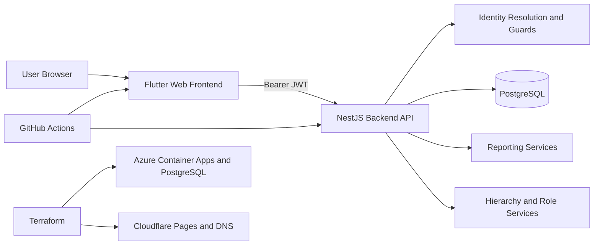

# Architecture

Logger is a monorepo with four main technical areas: backend API, frontend web app, end-to-end tests, and infrastructure-as-code.

## High-level architecture



## Repository components

| Component | Technology | Purpose |
| --- | --- | --- |
| Backend | NestJS, TypeScript, TypeORM, PostgreSQL | Authenticated API, domain logic, reporting, persistence |
| Frontend | Flutter Web, Riverpod, Go Router | Browser client for end users |
| E2E tests | Cucumber, TypeScript | API and journey validation |
| Infrastructure | Terraform | Production infrastructure provisioning |

## Backend architecture

The backend is assembled in `backend/src/app.module.ts` and currently wires these modules:

- `AuthModule`
- `CaslModule`
- `EntitiesModule`
- `AdminModule`
- `RolesModule`
- `UsersModule`
- `ActivityTypesModule`
- `IdpIdentitiesModule`
- `ActivitiesModule`
- `PeriodsModule`
- `ReportsModule`
- `HealthModule`

### Backend data flow

1. the request enters NestJS
2. middleware assigns or propagates a correlation ID
3. JWT guards validate the token
4. identity resolution maps the external identity to a local user
5. permissions and policies determine access
6. services execute business rules
7. TypeORM persists or reads from PostgreSQL
8. DTOs shape the HTTP response

### Backend cross-cutting concerns

| Concern | Implementation |
| --- | --- |
| Config validation | `ConfigModule` with Joi schema |
| Logging | `nestjs-pino` |
| Correlation IDs | custom middleware plus request logger integration |
| Validation | global `ValidationPipe` |
| Error handling | global `AllExceptionsFilter` |
| API docs | Swagger at `/api/docs` |

## Frontend architecture

The frontend is a Flutter web application organized around:

- `pages/` for route-level screens
- `widgets/` for reusable UI pieces
- `providers/` for Riverpod state
- `services/` for backend API calls
- `models/` for client-side data structures
- `config/` for API and auth inputs

The current app bootstrap automatically redirects unauthenticated users into the login flow.

## Domain architecture

The current data model centers on:

- entities and hierarchy
- users and role assignments
- activity types
- activities
- date availability via admin locks and exceptions
- reports derived from activities within hierarchy scope

### Hierarchy model

```text
PLATFORM
  -> UNION
    -> ASSOCIATION
      -> FIELD
```

### Access model

The system uses both explicit permissions and resource-level ability checks. In practice:

- some routes are guarded by admin role checks
- some routes use hierarchy-aware policies
- report access depends on the actor’s permitted scope

## Deployment architecture

Production deployment is split:

- backend container image to GHCR
- backend runtime on Azure Container Apps
- frontend deployment to Cloudflare Pages
- infrastructure maintained with Terraform modules and a root stack
